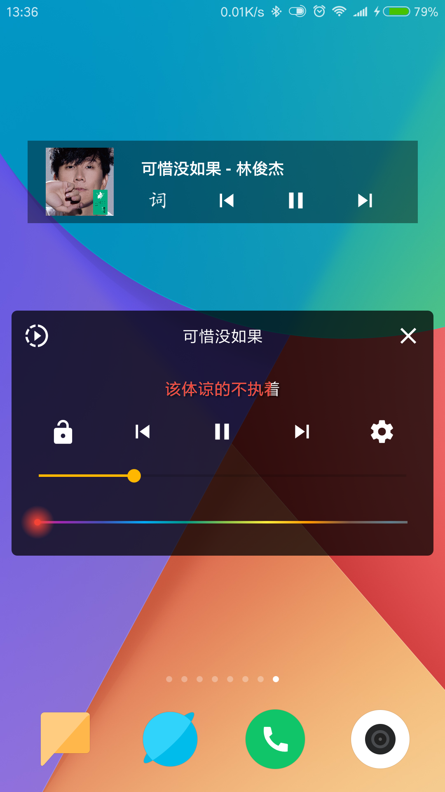
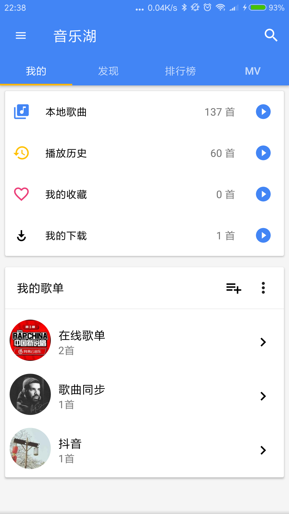
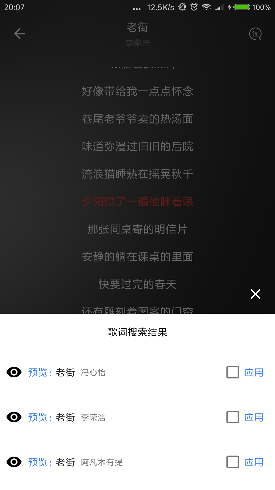
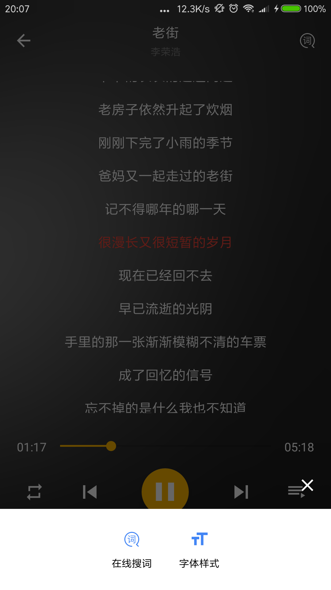
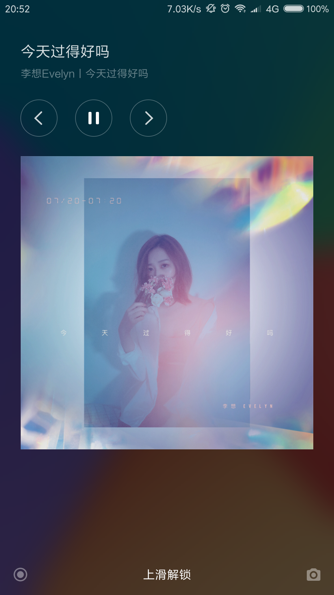

#
- 磨耳朵播放器

-Step 1. Add it in your root build.gradle at the end of repositories:

	allprojects {
		repositories {
			...
			maven { url 'https://jitpack.io' }
		}
	}
	
	dependencies {
        classpath 'com.android.tools.build:gradle:3.1.4'
        classpath 'com.github.dcendents:android-maven-gradle-plugin:2.0'
        // NOTE: Do not place your application dependencies here; they belong
        // in the individual module build.gradle files
   	 }
	 
-Step 2. Add the dependency
	
	apply plugin: 'com.github.dcendents.android-maven'
	group = 'com.github.cj7865794408'
	
	
	dependencies {
	        implementation 'com.github.cj7865794408:MoErDuo_Music_Lib:v1.0'
	}

# 更新日志

## v2.0.0
- 新增磨耳朵模块功能

## 更早
- 本地音乐播放，百度音乐，QQ音乐、虾米音乐、网易云音乐等网络音乐播放
- 支持在线歌曲下载
- 歌词播放、桌面歌词、桌面小控件
- 通知栏控制、线控播放、音频焦点控制
- QQ登录、在线歌单同步
- 百度电台列表，网易云mv排行榜，mv播放评论

# 相关项目|音乐API
- [PC端](https://github.com/sunzongzheng/music)
- [音乐API](https://github.com/sunzongzheng/musicApi)
- [Binaryify/NeteaseCloudMusicApi](https://github.com/Binaryify/NeteaseCloudMusicApi)

# 第三方库

- [rxjava](https://github.com/ReactiveX/RxJava)
- [retrofit](https://github.com/square/retrofit)
- [dagger2](https://github.com/google/dagger)
- [Glide](https://github.com/bumptech/glide)
- [LitePal](https://github.com/LitePalFramework/LitePal)
- [DSBridge](https://github.com/wendux/DSBridge-Android)
- [BaseRecyclerViewAdapterHelper](https://github.com/CymChad/BaseRecyclerViewAdapterHelper)
- [More..](https://github.com/caiyonglong/MusicLake/blob/develop/app/build.gradle)

# 软件运行截图

